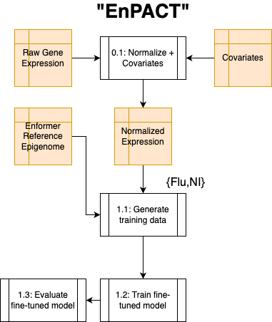
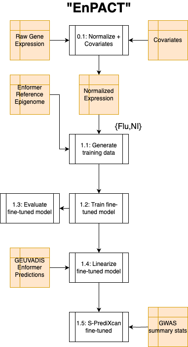

# What is EnPACT?

EnPACT is a modeling strategy which fine tunes DNA sequence-based molecular predictors to new datasets. Generally, the steps to train an EnPACT model are as follows: 

1. Assemble a training dataset of molecular features (gene expression, ChIP-seq peaks, etc.) of which you want to be able to predict the genetic component of variation across features. This will be the "Y" or "output" into the EnPACT model during training.
2. Generate "reference epigenome" predictions at molecular feature loci by passing reference genome DNA sequence from each loci into the DNA sequence-based molecular predictor. These "reference epigenome" predictions will then become the "X" or "input" into the EnPACT model during training.
3. Train the EnPACT model of choice across loci in the genome to predict "Y" from "X" at each loci in the training dataset using standard model training practices.

Pretty simple. In practice, the "En" in "EnPACT" refers to "Enformer", the sequence-based predictor explored here. However, there is no reason that this should be the **only** model which can fulfill this role, so this code is intentionally modular to encourage exploration of other sequence-based predictors. The EnPACT model is also a flexible, but important, choice. Linear elastic net and a simple convolutional neural net are two currently implemented options, but exploration is again encouraged with modular code support. 

## What is "Con-EnPACT"

Con-EnPACT is just "context-specific" EnPACT. It's what I'm calling my EnPACT models which I trained on a flu-context, multiomics dataset from [this study.](https://www.nature.com/articles/s41588-024-01668-z)

## Training an EnPACT model

The steps to train an EnPACT model are labeled in the following figure:

Scripts for each step are included in the "/scripts/" directory. For example, step 1.1 corresponds to "/scripts/1.1_generate_enpact_training_data.py".

### Configuration

Inputs for all steps are specified in a json style config file. An example can be found in [Example configuration with TWAS](example_json/example_config_with_twas.json). 

# Using EnPACT to explore the genetic component of diseases

Because molecular phenotypes must be related to the genetically controlled components of disease (as dictated by the central dogma), genetic predictors of molecular phenotypes can help bridge the gap between underlying genetic sequence and higher level observed phenotype. Integrative analyses used to make these insights are plenty. Currently, the following integrative analyses are supported in this repository:

1. TWAS (SPrediXcan)

## TWAS with EnPACT

### Overview

EnPACT models try to learn which elements of underlying DNA sequence are predictive of variation in the molecular phenotype of interest. This is similar to existing models used in TWAS analysis relating GWAS loci to molecular loci. The major difference is that existing TWAS models are trained to predict the variation of features (such as individual genes) across individuals in a population, while EnPACT models try to use variation across similar features in the genome (different genes, for example) during training. Both training approaches have theoretical pros and cons, but a nice possibility is to be able to also perform TWAS analysis with EnPACT style models. 

### Linearize EnPACT models

Doing this is not trivial. Here we implement a tractable method of converting the EnPACT model, which does not annotate individual SNP variant effects, into a form a compatible with the TWAS software SPrediXcan. The process is called **linearization** and involves the contruction of elastic models for each molecular feature in the linearization dataset. The linearization dataset here is just a population of individual's genotype data which we can make molecular predictions on. The models predict variation in each individual molecular feature **across** individuals in the linearization dataset. Rather than predicting observed (ground truth) expression in these individuals, as is the case in existing TWAS models, the linearization models predict _personalized_ EnPACT predictions generated from each individual's unique DNA sequence background at each molecular feature. In other words, these models approximate the EnPACT personalized predictions as a linear elalstic net, which has the bonus effect of also being TWAS compatible. Notably, linearization has nothing to do with the actual measured molecular features in the linearization dataset, it is simply a linear approximation (elastic net) of a non-linear model (Con-EnPACT: Enformer + Elastic Net).

### TWAS with SPrediXcan

Once we have a linearized version of our Con-EnPACT model, we are free to perform TWAS style analysis with it using available GWAS summary statistics.

The workflow including TWAS is as follows:

## Notes about linearization and running XWAS with EnPACT

Standard TWAS style analysis involves training linear molecular predictors for each feature (such as a gene) in the genome. These linear predictors rely on allelic dosage at proximal variants to each feature and uses learned weights to predict the feature value as a weighted sum of these allelic dosages. With trained model in hand, one can _impute_ molecular features for individuals in a typical GWAS study where such ground truth predictions are unavailabe. If these molecular predictions correlate with the GWAS trait across individuals in the GWAS population, this represents a TWAS association.

In practice, _summary_ analysis such as SPredixcan is used to directly associate the model weights with GWAS summary statistics because both exist at the SNP level. This is far more efficient than making personalized predictions across hundreds of thousands of individuals in a GWAS population and then running an association. It also helps explain why **linearization** of EnPACT models makes running TWAS-style analysis so much easier, as making Enformer predictions across hundreds of thousands of individuals is a massive computational expense.

However, the linearization process is still fairly computationally intensive. It requires personalized Enformer predictions to be made across individuals in the _linearization dataset_, and across features (for TWAS this is on the order of thousands of genes). For molecular features such as chromatin accessibility, the number of features (ATACseq peaks) can be more than 100,000. This also creates an intense computational bottleneck. 

For running TWAS-style analysis on other features (XWAS), we therefore have implemented a prioritization scheme where Con-EnPACT linearization is performed only at _signficant_ GWAS loci. This greatly reduces the scope of the XWAS analysis, but makes it more focused on areas where there is a high likelihood of genetic influence on the GWAS trait.

## To-do

- [] Better synchronize names of steps with steps in config file
- [] Store only a single copy of Enformer personalized predictions to reduce memory overhead.
- [] Option to delete personalized EnPACT predictions after contruction of linearized models.
- [] Remove expression specificity

